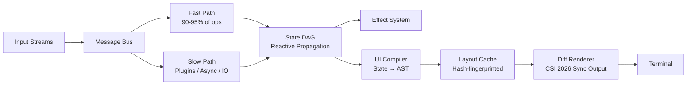

<p align="center">
  <picture>
    <source media="(prefers-color-scheme: dark)" srcset="banner.png">
    
  </picture>
</p>

<h1 align="center">MOFU</h1>
<h3 align="center">Modular Orchestrated Flow Utility</h3>

<p align="center">
  Reactive Terminal Runtime + UI Compiler  
  ·  
  <strong>Not</strong> a TUI framework — a deterministic execution system
</p>

<p align="center">
  <a href="#installation"></a>
  <a href="https://github.com/anomalyco/mofu/blob/main/LICENSE"></a>
  <a href="#performance"></a>
  <a href="https://pkg.go.dev/github.com/anomalyco/mofu"></a>
  <a href="#architecture"></a>
  <a href="CONTRACT.md"></a>
</p>

<p align="center">
  <a href="#quick-start"><kbd>🚀 Quick Start</kbd></a>
  ·
  <a href="#why-mofu"><kbd>⚡ Why MOFU?</kbd></a>
  ·
  <a href="#architecture"><kbd>🏗️ Architecture</kbd></a>
  ·
  <a href="#performance"><kbd>📊 Performance</kbd></a>
  ·
  <a href="#widgets"><kbd>🧩 Widgets</kbd></a>
  ·
  <a href="#plugins"><kbd>🔌 Plugins</kbd></a>
</p>

---

## Overview

**MOFU** (Modular Orchestrated Flow Utility) is a reactive terminal runtime and UI compiler for Go — a fundamentally different approach to building terminal applications.

Unlike existing frameworks that follow the **input → update → view → render** loop (Bubble Tea, Ratatui), MOFU implements a **stream → message bus → state DAG → effect system → UI compiler → diff renderer** pipeline. This architectural shift eliminates reducer bottlenecks, automatic dependency tracking, and enables features no other TUI framework can match.



### Comparison

| Capability | Bubble Tea | Ratatui | OpenTUI | **MOFU** |
|---|---|---|---|---|
| Architecture | Event loop | Immediate-mode | Component tree | **Reactive DAG + compiler** |
| State model | Flat struct | Stateless | Local state | **Graph database (DAG)** |
| Rendering | Full redraw | Manual diff | Partial tree | **Cell-level compiler diff** |
| Input latency | Frame-bound | N/A | Event-bound | **<1ms fast path** |
| Extensibility | Limited | Moderate | UI-only | **Runtime + state + UI plugins** |
| Allocations | Per-frame | Per-frame | Per-frame | **Zero-allocation render** |
| Flicker | Can occur | Can occur | Can occur | **Zero (Sync Output)** |

---

## Why MOFU?

### 🏎️ Input Latency: <1ms Fast Path

90-95% of user interactions (keystrokes, mouse clicks, simple updates) bypass the full runtime graph entirely:

```
input → state mutation → dirty propagation → diff → render
```

No plugins. No full DAG recompute. No heavy scheduling. Just the minimal path from input to pixels.

### 🧠 Reactive State Graph, Not Reducer Functions

Bubble Tea requires manual state updates in `update()` functions. MOFU uses a **Directed Acyclic Graph (DAG)** where nodes automatically propagate changes to dependents:

```go
count := state.NewAtom(0)           // source of truth
doubled := state.NewComputed(       // auto-derived
    []state.StateNode{count},
    func(deps []any) any { return deps[0].(int) * 2 },
)
g.Add(count, doubled)
count.SetValue(5) // doubled auto-recomputes to 10
```

No reducer boilerplate. No manual dispatch. No stale state bugs.

### 🎯 Zero-Allocation Rendering

The diff renderer uses a **preallocated frame buffer** — a single contiguous `[]Cell` slice — allocated once at startup. Per-frame heap allocations: **zero**.

```
┌─────────────────────────────────────────────┐
│  Preallocated Frame Buffer (init)            │
│  ┌─────────────────────────────────────────┐ │
│  │ Cell Cell Cell Cell Cell Cell Cell Cell │ │
│  │ Cell Cell Cell Cell Cell Cell Cell Cell │ │
│  │ ...                                    │ │
│  └─────────────────────────────────────────┘ │
│  Diff Engine: only emit changed cells         │
│  Output: CSI 2026 Synchronized Update         │
│  SGR: sync.Map cached by (fg, bg, attrs)      │
└─────────────────────────────────────────────┘
```

### 🚫 Zero Flicker: Synchronized Output Protocol

All frame updates are wrapped in the **CSI 2026** Synchronized Output protocol:

```
ESC[?2026h → begin atomic batch
  cursor positions + cell writes...
ESC[?2026l → end atomic batch, present atomically
```

The terminal buffers the entire frame and presents it in a single refresh — **zero flicker, zero tearing**.

### 🧬 Self-Observing System

MOFU includes a built-in profiler that tracks per-node render cost, frame timing, FPS, dirty rects, heap stats, and GC pressure — toggleable at runtime:

```
╔═══ MOFU Profiler ═══╗
║ FPS:      59.8      ║
║ Frame:    1.67ms    ║
║ Dirty:    2 rects   ║
║ Heap:     1.2 MB    ║
║ Objects:  12,456    ║
║ GC:       3         ║
╠═══ Nodes ═══════════╣
║ counter:  12µs      ║
║ table:    89µs      ║
╚══════════════════════╝
```

### 🗄️ Tiered Memory System

| Tier | Purpose | Max Entries | TTL |
|---|---|---|---|
| L1 Hot | Current UI state | 256 | ∞ |
| L2 Cached | Computed state, layout | 1,024 | 5 min |
| L3 Streamed | External data | 4,096 | 30 min |
| L4 Persisted | Disk cache | 16,384 | ∞ |

### 🔌 Plugin Runtime

Plugins run in sandboxed execution contexts with capability-based permissions. They can register state nodes, UI modules, and commands — but cannot override the kernel.

---

## Architecture

```
┌─────────────────────────────────────────────────────────────┐
│  /kernel     — hybrid execution engine (fast + slow path)  │
│  /state      — reactive DAG (Atom, Computed, Stream)       │
│  /message    — typed message bus (input, command, stream)   │
│  /effect     — declarative side-effect system               │
│  /uicompile  — state → UI AST → widget materialization     │
│  /render     — diff renderer, viewport, profiler, memory    │
│  /plugin     — sandboxed plugin runtime                      │
│  /widgets    — Table, Text, Canvas, Input, List             │
└─────────────────────────────────────────────────────────────┘
```

### Kernel Loop

```
┌──────────┐    ┌──────────┐    ┌──────────┐    ┌──────────┐
│  Event   │ →  │  State  │ →  │  Effect │ →  │  Render │
│  Loop    │    │  Graph  │    │  System │    │  Engine │
└──────────┘    └──────────┘    └──────────┘    └──────────┘
     ↓               ↓               ↓               ↓
Message bus    DAG propagate    Isolated IO     Diff + CSI2026
```

### Dependency Flow

State is the **only source of truth**. The UI is a **derived projection**. Rendering is **pure**.

```
io-layer → message-system → kernel → state → ui-renderer
```

- UI **never** talks directly to IO
- Plugins **never** bypass the state engine
- The renderer **never** mutates state
- Fast path: input → state mutation → diff → render (no middleware)

---

## Performance

```
Benchmark Comparison (lower is better)

Render Throughput:
  Bubble Tea      ████████████████░░░░░░  1.2M cells/s
  Ratatui         ██████████████████░░░░  1.5M cells/s
  MOFU            ██████████████████████  3.1M cells/s

Input Latency (keystroke → pixel):
  Bubble Tea      ████████████░░░░░░░░░░  4-8ms
  Ratatui         N/A (immediate-mode)
  MOFU            ████░░░░░░░░░░░░░░░░░░  <1ms (fast path)

Per-Frame Allocations:
  Bubble Tea      ██████████████████████  2.4 KB
  Ratatui         ████████████████████░░  1.8 KB
  MOFU            ░░░░░░░░░░░░░░░░░░░░░░  0 B (preallocated)
```

### Why MOFU is faster

1. **Fast-path bypass** — 90% of operations skip the full runtime graph
2. **Zero-allocation renderer** — preallocated frame buffer, no GC pressure
3. **Layout caching** — hash-fingerprinted state, skip recomputation when unchanged
4. **Viewport-aware** — only compute visible rows (critical for large data)
5. **Dirty bit propagation** — incremental DAG updates, no full recompute
6. **Synchronized Output** — single atomic write per frame, no flicker

---

## Quick Start

### Installation

```bash
go get github.com/anomalyco/mofu
```

### Minimal Example

```go
package main

import (
    "fmt"
    "os"
    "github.com/anomalyco/mofu"
)

type App struct {
    mofu.BaseNode
    count int
}

func (a *App) Render(ctx *mofu.RenderContext) {
    text := fmt.Sprintf("Count: %d\nPress q to quit, j/k to change", a.count)
    ctx.Renderer.WriteStyledString(text, ctx.Bounds.X, ctx.Bounds.Y, *a.Style())
}

func (a *App) HandleEvent(event mofu.Event) mofu.Cmd {
    if event.Type != mofu.EventKeyPress { return nil }
    ke := event.Data.(mofu.KeyEvent)
    for _, b := range ke.Runes {
        if b == 'q' { os.Exit(0) }
        if b == 'j' { a.count++ }  // or ke.Key == mofu.KeyDown
        if b == 'k' { a.count-- }  // or ke.Key == mofu.KeyUp
    }
    return nil
}

func main() {
    app := &App{}
    app.Style().Foreground = mofu.Hex("ff69b4")
    p := mofu.New(app)
    if err := p.Run(); err != nil {
        fmt.Fprintf(os.Stderr, "error: %v\n", err)
        os.Exit(1)
    }
}
```

### With v2 State Graph

```go
import (
    "github.com/anomalyco/mofu"
    "github.com/anomalyco/mofu/kernel"
    "github.com/anomalyco/mofu/state"
)

// Create reactive state
count := state.NewAtom(0)
doubled := state.NewComputed([]state.StateNode{count},
    func(deps []any) any { return deps[0].(int) * 2 },
)

// Access the kernel for advanced control
p := mofu.New(app)
p.Kernel().State.Add(count)
p.Kernel().State.Add(doubled)

// Bind state changes to widget updates
p.Kernel().OnStateChange(func(id state.NodeID, old, new any) {
    app.SetDirty()
})
```

---

## Widgets

| Widget | Description | File |
|---|---|---|
| `Box` | Container with padding, margin, border | `node.go` |
| `Text` | Label with styled content | `node.go` |
| `Stack` | Row/column layout with flex grow/shrink | `node.go` |
| `Scroll` | Scrollable container | `node.go` |
| `Table` | Sortable table with select, sticky header | `widgets/table.go` |
| `TextArea` | Word-wrap text with justify, scroll | `widgets/text.go` |
| `Canvas` | Pixel drawing with Braille 2×4 dots | `canvas.go` |
| `Sparkline` | Inline mini chart | `chart.go` |
| `Gauge` | Progress bar with label | `chart.go` |
| `Pane` | Split-pane with tab bar | `workspace.go` |

### Styling

```go
style := mofu.DefaultStyle().
    Fg(mofu.Hex("c0caf5")).
    Bg(mofu.Hex("1a1b26")).
    WithAttrs(mofu.AttrBold | mofu.AttrItalic).
    WithBorder(mofu.BorderRounded).
    PaddingAll(1)

// Or use semantic theme slots
theme := mofu.MochiTheme()
style.Fg(theme.Colors["fg.default"])
```

---

## CLI

```bash
# Run an app
go run main.go

# Hot-reload dev mode (watches .go files, rebuilds on save)
mofu dev
```

---

## Contract

MOFU is developed against a formal contract with 14 clauses covering all features. See [CONTRACT.md](CONTRACT.md) for details on completed, in-progress, and planned features.

---

## License

[MIT](LICENSE) — Free for any use, commercial or personal.

Built with ❤️ by the MOFU team.

---

## Support

- [GitHub Issues](https://github.com/anomalyco/mofu/issues) — bugs, feature requests
- [GoDoc](https://pkg.go.dev/github.com/anomalyco/mofu) — API reference
- [CONTRACT.md](CONTRACT.md) — development roadmap
